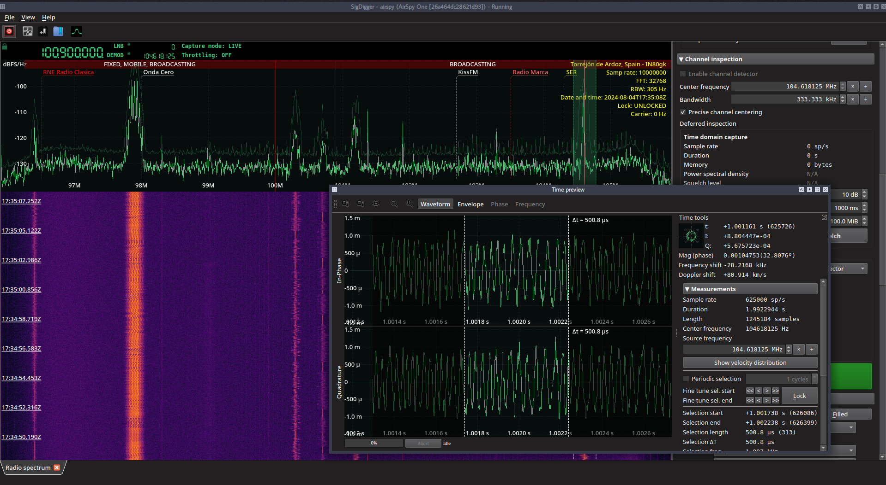

# SigDigger - The free digital signal analyzer
SigDigger is a free digital signal analyzer for GNU/Linux and macOS, designed to extract information of unknown radio signals. It supports a variety of SDR devices through SoapySDR, and allows adjustable demodulation of FSK, PSK and ASK signals, decode analog video, analyze bursty signals and listen to analog voice channels (all in real time).

 

## Notes for existing users
We do not clone `develop` anymore. All four projects (SigDigger, SuWidgets, Suscan and Sigutils) keep the latest working changes in the `master` branch.
 
## NOTES FOR FIRST USERS
You may want to start by giving a look to the [**User's Manual**](https://github.com/BatchDrake/SigDigger/blob/master/doc/SigDigger_User_Manual.pdf).

SigDigger is a GUI tool that serves as a wrapper for lower-level libraries like Suscan and Sigutils, and therefore you will need to build these dependencies first. If you want to avoid headaches and start using SigDigger right away, try any of the following:

* Downloading the latest [**development build**](https://github.com/BatchDrake/SigDigger/releases/tag/latest) as a self-contained AppImage file (GNU/Linux only)
* Requesting a custom `.dmg` (macOS users only, I have to create these on demand because I currently do not own any Apple machine and little tweaks need to be done from version to version)
* Building from sources and install system-wide (Unix in general):```
    % git clone --recursive https://github.com/BatchDrake/sigutils
    % cd sigutils && mkdir -p build && cd build && cmake .. && make && sudo make install && cd ../..
    % git clone --recursive https://github.com/BatchDrake/suscan
    % cd suscan && mkdir -p build && cd build && cmake .. && make && sudo make install && cd ../..
    % git clone https://github.com/BatchDrake/SuWidgets
    % cd SuWidgets && qmake6 SuWidgetsLib.pro && make && sudo make install && cd ..
    % git clone https://github.com/BatchDrake/SigDigger
    % cd SigDigger && qmake6 SigDigger.pro && make && sudo make install && cd ..
  ```
* Let the [blsd](https://actinid.org/blsd) script handle all those details for you (GNU/Linux). This script will build SigDigger inside a directory under the current working directory (nothing gets installed system-wide). This directory can be placed anywhere you like, and contains a script that launches SigDigger.
    ```
    % wget https://actinid.org/blsd
    % chmod a+x blsd
    % ./blsd
    ```
    * **Bonus:** you can pass arguments to `blsd` to specify which plugins you want to be downloaded and bundled with SigDigger. The name of the plugins are just the names of the repositories in my GitHub account from which the code is pulled. I recommend the [AmateurDSN plugin](https://github.com/BatchDrake/AmateurDSN) because of its versatility, but you may also want to take a look to [APTPlugin](https://github.com/BatchDrake/APTPlugin), [AntSDRPlugin](https://github.com/BatchDrake/AntSDRPlugin) and [ZeroMQPlugin](https://github.com/BatchDrake/ZeroMQPlugin).

* **Windows users:** sorry, Windows is a mess, I do not own Windows machines either and it is currently impossible to ensure Windows builds that include all the DLL dependencies in a reproducible way. You can try to build it from source on your own, although in this case I recommend to follow the steps in the [**User's Manual**](https://github.com/BatchDrake/SigDigger/blob/master/doc/SigDigger_User_Manual.pdf)
  
## Wait, why does it look like Gqrx?
After years dealing with SDR software, I realized that Gqrx had the best UI of them all: minimalistic yet operative. Earlier versions of the UI were somewhat different, but after a lot of debugging I came to the conclusion that it would be better off if I just tried to mimic existing (and successful) software, reducing the learning curve to the new feature set.

You may notice that the spectrum widget looks a lot like Gqrx's. This is because the specturm widget is actually Gqrx's with some ~~minimal~~ modifications (like support for configurable Waterfall palettes, or a OpenGL backend). I tried to code my own Waterfall widget in Suscan and Xorg ended up hogging the CPU, so I'm not reinventing the wheel anymore: I decided to extend the existing Gqrx's Plotter widget so it fits SigDigger's set of features.

Apart from the UI layout and the plotter widget, SigDigger bears little resemblance to Gqrx: Gqrx depends on GNU Radio, while SigDigger is a Qt5 frontend for Suscan. The DSP chains are totally different and Suscan's thread model is optimized for a very specific set of tasks.

## How am I supposed to compile this?
SigDigger depends on three different projects: **Sigutils**, **Suscan** and **SuWidgets**. You need to build and install these projects in your computer prior to compile SigDigger.

* Sigutils build instructions can be found [here](https://github.com/BatchDrake/sigutils/blob/master/README.md).
* Suscan build instructions can be found [here](https://github.com/BatchDrake/suscan/blob/master/README.md).

After successfully building Sigutils and Suscan, you can now proceed to build **SuWidgets**. SuWidgets is Qt5/Qt6 graphical library containing all SigDigger's custom widgets. In order to build it, ensure you have at least the Qt5 (>= 5.9) development framework installed in your system and then run:

```
% git clone https://github.com/BatchDrake/SuWidgets
% cd SuWidgets
% qmake SuWidgetsLib.pro
% make
% sudo make install
```

If you the above steps were successful, chances are that you will success on building SigDigger too. In order to build SigDigger, do:

```
% git clone https://github.com/BatchDrake/SigDigger
% cd SigDigger
% qmake SigDigger.pro
% make
% sudo make install
```

And, in order to run SigDigger, just type:

```
% SigDigger
```

If the command above fails, it is possible that you got SigDigger installed somewhere else, like /opt/SigDigger. In that case, you can try to run instead:

```
% /opt/SigDigger/bin/SigDigger
```

## Precompiled releases
You can find precompiled releases under the "Releases" tab in this repository. For the time being, these releases are meant for x64 Linux only (preferably Debian-like distributions) and have been minimally tested. Although I have plans to port Sigutils, Suscan and SigDigger to other platforms, I'd like to have a stable codebase before going any further.

Obviously, your feedback will make my job easier. If you experience any issues building or using SigDigger, go ahead and use the fantastic GitHub's bug tracking system. It works pretty well and it is way easier for me to keep track of the existing issues.

Looking forward for your feedback! :)

---
73 de EA1IYR
